# Photoshop-Demo
Design a basic photoshop-like software developed with qt creator, opencv and algorithms of images processing as the final project of 2021 summer lectures.

[`presentation`](./asset/photoshop_demo.pdf)、
[`source code`](./src/)、
[`demo video`](./asset/audio/)

## Main Window
### Interface
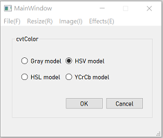
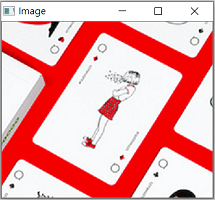
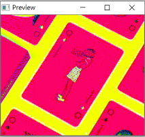 <br/><br/>
The console window is consist of workbench, original image window and preview windows. The workbench can switch to different pages by triggering different action, and the effect of any function will dsiplay on the preview window as the preview for user to choose that using this method or not. By QDialogButton, ones could `Cancel` the preview or `Done` this method, display the result on the window of current image and waiting for saving.

### Pages Switch
```cpp
void MainWindow::switchPages()
{
    QAction *action = qobject_cast<QAction*>(sender());
    if(action == ui->crop)
    {
        ...
    }
    else if(action == ui->blur)
    {
        ...
    }
    else if(action == ui->sharpen)
    {
        ...
    }
    ...
}
```
Connect all the action signals to the `switchPages()` slots function, and using `qobject_cast` to find the action of sender, then switch to corresponding pages. By that, ones could be transferred different functional interface like: `Crop`, `Resize`, `Rotate`, `Color tuner` and so on.

### [Import Image]
With the drag and drop event, user could `select/open` their original image by dragging the image from the dictionary of their computer. <br> 
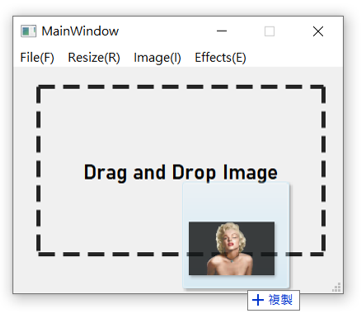
```cpp
protected:
    void dropEvent(QDropEvent*);
    void dragEnterEvent(QDragEnterEvent*);
```
Add the declaration in the header file and include the corresponding header file first to call and revise such event function.
```cpp
void MainWindow::dragEnterEvent(QDragEnterEvent *event)
{
    if(true && image.empty())
    {
        event->acceptProposedAction(); // accept to drag in the image
        ui->label->setStyleSheet("border: 5px dashed #242424");
    }
}

void MainWindow::dropEvent(QDropEvent *event)
{
    QList<QUrl>urls = event->mimeData()->urls();
    if(urls.empty()) return;
    QString filePath = urls.first().toLocalFile();
    if(!filePath.isEmpty())
    {
        image = imread(filePath.toStdString().c_str());
        imshow("Image", image); //show on the Image window
        emit ui->Crop->triggered(); // switch to the crop pages as deflaut
    }
}
```

## Geometry Adjustments

### [Image Resize](./src/resize.cpp)
Cooperate with `QSlider` to display the effects of resizing in the preview window in real time. Then user could modify their image into a proper size.
```cpp
void Resize::valueChanged(int value)
{
    float percentage = (value + 20.0) / 20.0;
    int width = src.cols * percentage;
    int height = src.rows * percentage;
    cv::resize(src, temp, Size(width,height));
    imshow("Preview", temp);
}
```
### [Image Rotate](./src/rotate.cpp)
There are some type of Rotate that support in this demo. The basic type is like `vertical`, `horizontal` and the implement aslo show below.
```cpp
void Rotate::rotate()
{
    QPushButton *button = qobject_cast<QPushButton*>(sender());
    if(button == vertical) 
    {
        flip(dst, dst, 0); // for vertical rotate
    }
    else if(button == horizontal)
    {
        flip(dst, dst, 1); // for horizontal rotate
    }
    else if(button == counterclockwise)
    {
        transpose(dst, dst); // for counterclockwise rotate
        flip(dst, dst, 0);
    }
    else
    {
        transpose(dst, dst); // for clockwise rotate
        flip(dst, dst, 1);
    }
    imshow("Preview", dst);
}
```

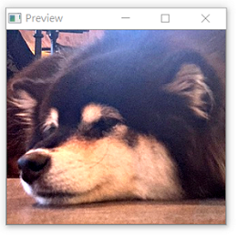
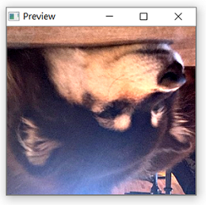
### [Image Crop](./src/crop.cpp)
Using the `setMouseCallBack()` function in OpenCV and self-revise the `onMouse()` function to attain complete attributes. For declaring and using the `onMouse()` function that almostly dosen't use member function and variable in a class, ones have to declare the `onMouse()` function as static member function.
```cpp
static void onMouse(int event, int x, int y, int flag, void *param);
```
The Crop method using in this Photoshop demo prject contain mainly two ways:
* **Rectangle Region** <br/>
A basic crop function in image processing, and users can selected a `rectangle` region they want in original image. <br/><br/>
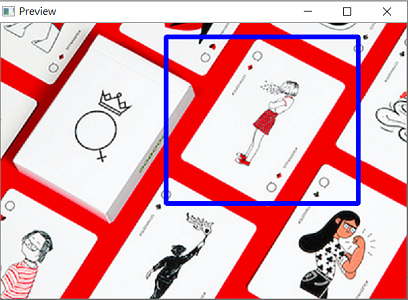 
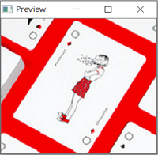<br/><br/>
```cpp
void Crop::onMouse(int event, int x, int y, int flags, void *param)
{
    Crop *self = (Crop*)param; // get the pointer from calling class
    Mat tempImg = self->dst.clone();
    if(event == EVENT_LBUTTONDOWN) // the condition as the mouse clicked, record the start point
        self->s = Point2f(x,y);
    else if(event == EVENT_MOUSEMOVE && (flags & EVENT_FLAG_LBUTTON)) 
    {
        cv::rectangle(tempImg, self->s, Point(x,y), Scalar(255,0,0), 5);
        imshow("Preview", tempImg);
    }
    else if(event == EVENT_LBUTTONUP) // finish selecting 
        self->d = Point2f(x,y);
    else if(event == EVENT_RBUTTONDOWN) //clicked right button to preview the result
    {
        int width = abs(self->s.x - self->d.x);
        int height = abs(self->s.y - self->d.y);
        Rect roi(self->s, Size(width,height));
        self->dst = tempImg(roi);
        imshow("Preview", self->dst);
    }
}
```
By judging the event and flag (draging or not), ones could select the region that want in the `rectangle` frame, and after right button clicked, user could preview the result in the preview windows right away. If the result is statisfying, just clicked `Done` to store as a current image, or just `Cancel` and recreate another rectangle frame or exit the crop session.
* **Self Selected Region** <br/>
For Some `not rectangle like` region of the image part, that ones holp to modulate and project into rectangle shape. <br/><br/>

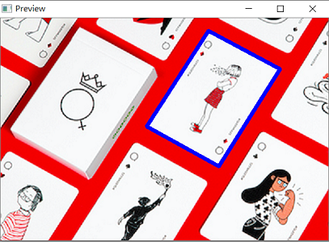
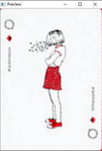 <br/><br/>
```cpp
void Crop::onMouse(int event, int x, int y, int, void *param)
{
    Crop *self = (Crop*)param;
    Mat tempImg = self->dst.clone();
    if(event == EVENT_LBUTTONDOWN)
        self->point.append(Point(x,y)); //
    else eif(event == EVENT_RBUTTONDOWN)
    {
        ... // find the src points, dst points and height/width ratio
        Mat matrix;
        matrix = getPerspectiveTransform(s, d);
        cv::warpPerspective(tempImg , self->dst, matrix, Size(400,400*ratio));
        self->point.clear();
        imshow("Preview", self->dst);
    }
    else
    {
        ...//display the points and path that have been selected
        imshow("Preview", tempImg);
    }
}
```
Users could selected the region they want, only that could be converted into rectangle. And just clicked the corner of the region, then click the right mouse button, we could use `getPerspective()` function in OpenCV to generate transform matrix, and then using `warpPerspective()` to transform the selected region into the rectangle shape then display on the preview windows.

## Color Adjustments
### [Blurring](./src/blur.cpp)
Using the vary function in the OpenCV like : `blur()`, `gaussianBlur()`, `median()` and `bilateral()`, users could attain different type of bluring and effects. Simply, median blur has the largest degree in bluring, that making the image more like comic and a little be ridiculous. The bilateral filter is a special one, that it could blur the image, but at the same time preserve the edges of the image content. From the image of bilateral bluring, you can see that the image is face is clear, but the hair region start bluring.
```cpp
switch (type) {
case Blur::box:
    cv::blur(src, dst, Size(kernel,kernel));
    break;
   
case Blur::gaussian:
    GaussianBlur(src, dst, Size(kernel,kernel), 0, 0);
    break;
        
case Blur::median:
    medianBlur(src, dst, kernel);
    break;
      
case Blur::bilateral:
    bilateralFilter(src, dst, 5, kernel * 10, kernel * 10);
    break;
        
default:
    dst = src.clone();
}
```


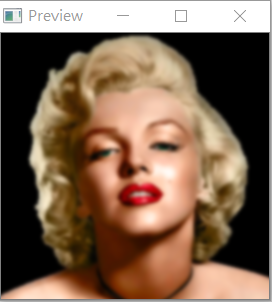
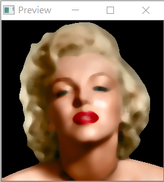
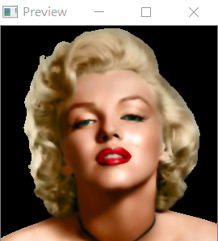 <br/><Br/>
With the `QSpinBox` , ones could adjust the size of kernel in the same time. Below are some algorithms and basic concept, intro of each image blurring. Clicked the connection and turn to another blank pages.
* [Bluring Algorithms](./dev/alogrithms/)
### [Sharpen](./src/sharpen.cpp)
The method of sharpen has mainly two ways : ones is using the `laplacian` operator, and the others way is by inverse weighted with `Gaussian blur`.
* Laplacian
```cpp
weight = -(value/50.0);
cv::Laplacian(src, dst, CV_32F, 3);
addWeighted(copy, 1 - weight, dst, weight, 0, dst);
dst.convertTo(dst, CV_8UC2);
```
* Gaussain Blur
```cpp
weight = -(value/25.0);
GaussianBlur(src, dst, Size(0,0), 10, 0);
addWeighted(src, 1 - weight, dst, weight, 0, dst);
```
### [Color Space Transform](./src/cvtcolor.cpp)
In the section, I just operating the `cvtColor()` function in openecv, to adjust the color space of cooresponding selections. And ones could find out the color of the image has changed as the color space is different. To avoid the leak of channel, I check that the number of the channel before converts that the cvtColor doesn't have to convert the gray picture to color picture.
```cpp
void cvtColor(InpytArray src, OutputArray dst, int code, int dstCn = 0);
```
### [Color Channel](./src/channel.cpp)
In the channel session, users could adjust the pixels values of RGB of the orignal image through the `QSlider`. The slider is set to the average value (as the raw image) in the beginning. And by the linear transformation, `Alpha` for adjust the contrast of the image, `Beta` for adjusting the brightening of the image.


```cpp
for(int row = 0; row < rows; row++)
{
    for(int col = 0; col < cols; col++)
    {
       int b = src.at<Vec3b>(row, col)[0];
       int g = src.at<Vec3b>(row, col)[1];
       int r = src.at<Vec3b>(row, col)[2];

       dst.at<Vec3b>(row, col)[0] = saturate_cast<uchar>(alpha * b + beta);
       dst.at<Vec3b>(row, col)[1] = saturate_cast<uchar>(alpha * g + beta);
       dst.at<Vec3b>(row, col)[2] = saturate_cast<uchar>(alpha * r + beta);
     }
}
```

## Image Effect
### [Color Effects](./asset/image/color.cpp)
In this part, I jsut try to adjust the weight and proportions of each channel to get a proper or fantastic `effects`. Ones could using different type of filter below and get some needed one. Besides, it's welcome for others to recommand others uesful color effect filter to extend this function.
```cpp
dst.at<Vec3b>(row, col)[0] = saturate_cast<uchar>(0.272*b + 0.534*g + 0.131*r);
dst.at<Vec3b>(row, col)[1] = saturate_cast<uchar>(0.168*b + 0.686*g + 0.349*r);
dst.at<Vec3b>(row, col)[2] = saturate_cast<uchar>(0.189*b + 0.769*g + 0.393*r);
```
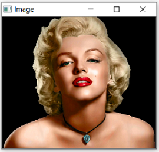
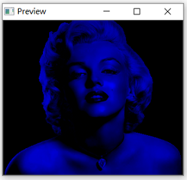
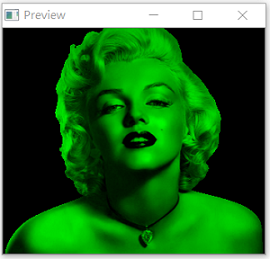
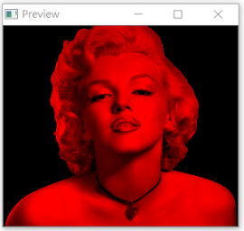
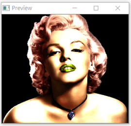
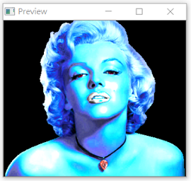
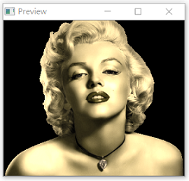

### [Special Effects](./src/special.cpp)
By modifying each pixels values, user could got different `texture` or `effects` through this function. General method is add a color or effects mask above the image or adjust the valus like color effects.
```cpp
Mat maskImg(src.size(), CV_64F);
Point firstP = Point(maskImg.size().width/2, maskImg.size().height/2);
double radius = 1.0, power = 0.8;
double maxImgRadius = radius *getDistanceFromCorner(maskImg.size(), firstP);
maskImg.setTo(Scalar(1));
for(int i = 0; i < maskImg.rows; i++)
{
    for(int j = 0; j < maskImg.cols; j++)
    {
        double temp = sqrt(pow((double)(firstP.x - Point(j, i).x), 2) + \
            pow((double)(firstP.y - Point(j, i).y), 2)) / maxImgRadius;
        temp *= power;
        double tempS = pow(cos(temp),4);
        maskImg.at<double>(i, j) = tempS;
    }
}
```
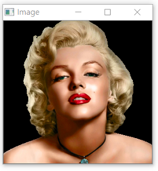
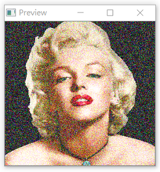
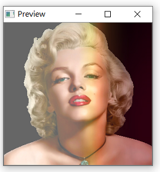
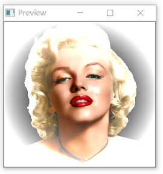
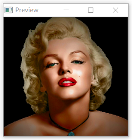
